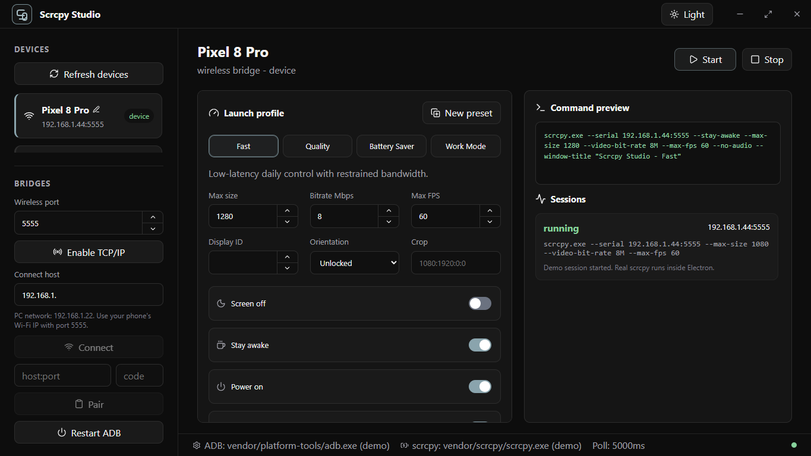
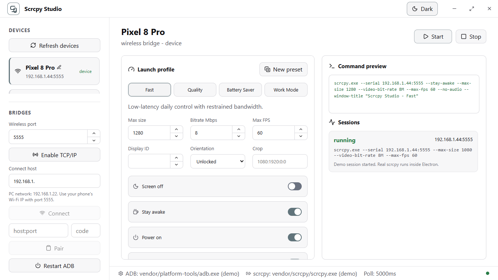

# Scrcpy Studio

Scrcpy Studio is a Windows-first desktop control surface for scrcpy and ADB. It wraps the bundled scrcpy and Android platform-tools binaries with a polished queue-free UI, device list, profiles, session logs, wireless ADB helpers, and reverse remote controls.

## Screenshots

### Dark mode



### Light mode



## Features

- Detect USB, wireless, emulator, unauthorized, and offline ADB devices.
- Start scrcpy sessions from named launch profiles.
- Configure video size, bitrate, FPS, display, audio, input, window, recording, and extra scrcpy args.
- Rename devices locally.
- Pair, connect, disconnect, and restart ADB from the UI.
- Automatically repairs wireless ADB when a USB device is available by enabling `adb tcpip`, reading the phone Wi-Fi IP from Android, and reconnecting to `IP:5555`.
- Includes a reverse remote server for controlling the Windows desktop from an Android browser/app, protected by a random per-session URL token.
- Runs without administrator elevation by default; start it as administrator only when a specific input/game flow needs elevated input access.

## Download

Most users should download the Windows installer from [GitHub Releases](https://github.com/Roinur/Scrcpy-studio/releases).

## Install From Source

```powershell
git clone https://github.com/Roinur/Scrcpy-studio.git
cd Scrcpy-studio
npm install
npm run package
```

`npm install` downloads the Windows `scrcpy` and Android platform-tools binaries into `vendor/` automatically.

The Windows installer is written to `release/`.

## Development

```powershell
npm install
npm run dev
```

## Build

```powershell
npm run build
npm run package
```

## Required Vendor Files

The packaged app expects these folders in `vendor/`, created automatically by `npm install`:

- `platform-tools/` with `adb.exe`
- `scrcpy/` with `scrcpy.exe`

To refresh them manually:

```powershell
npm run install:vendor
```

## Credits

Scrcpy Studio is built around [`Genymobile/scrcpy`](https://github.com/Genymobile/scrcpy), the official open-source project for displaying and controlling Android devices from a computer. scrcpy is licensed under Apache-2.0.

Android Debug Bridge comes from Google's Android platform-tools.
